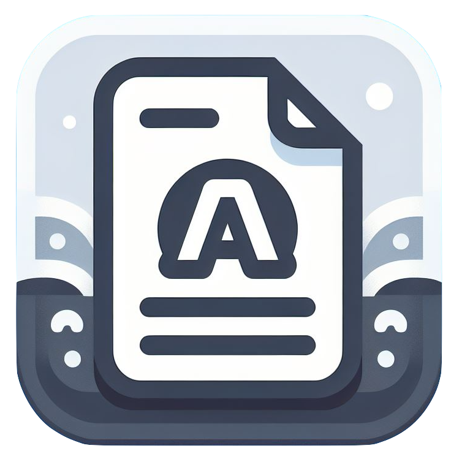

AndroidPDFPreview is a lightweight and easy-to-use SDK that enables you to display and interact with PDF documents in your Android apps. Built upon PdfiumAndroid for decoding PDF files and barteksc/AndroidPdfViewer for rendering, AndroidPDFPreview provides a seamless and user-friendly experience for viewing PDFs on Android devices. With support for gestures, zoom, and double tap, AndroidPDFPreview offers a comprehensive solution for integrating PDF preview functionality into your Android apps.

## Features

* Display and interact with PDF documents
* Support for gestures, zoom, and double tap
* Lightweight and easy to integrate into your Android apps
* Compatible with Android versions 4.1 and above

## Installation

To install AndroidPDFPreview, add the following dependency to your project's Gradle file:

```
dependencies {
    implementation 'io.github.rhariskumar3:androidpdfpreview:1.0.0'
}
```

## Usage

To use AndroidPDFPreview, simply create a PDFView instance and pass it the path to the PDF file you want to display. For example:

XML

```
<com.harissk.pdfpreview.PDFView
    android:id="@+id/pdf_view"
    android:layout_width="match_parent"
    android:layout_height="match_parent" />
```

Use code with caution. Learn more

## Additional Features

AndroidPDFPreview supports a number of additional features, including:

* Page navigation
* Search
* Table of contents
* Bookmarks
* Annotations

## Contributing

We welcome contributions to AndroidPDFPreview. Please feel free to submit pull requests or file issues on GitHub.

## Contact

If you have any questions or feedback, please feel free to contact us at [email protected]

## Acknowledgements

We would like to thank the following projects for their contributions to AndroidPDFPreview:

* [Pre-compiled binaries of PDFium](https://github.com/bblanchon/pdfium-binaries)
* [AndroidPdfViewer](https://github.com/barteksc/AndroidPdfViewer)

We hope you find AndroidPDFPreview to be a valuable tool for developing your Android apps.

## License

    Copyright 2023 AndroidPDFPreview Contributors

    Licensed under the Apache License, Version 2.0 (the "License");
    you may not use this file except in compliance with the License.
    You may obtain a copy of the License at

       https://www.apache.org/licenses/LICENSE-2.0

    Unless required by applicable law or agreed to in writing, software
    distributed under the License is distributed on an "AS IS" BASIS,
    WITHOUT WARRANTIES OR CONDITIONS OF ANY KIND, either express or implied.
    See the License for the specific language governing permissions and
    limitations under the License.

** Happy coding! **
